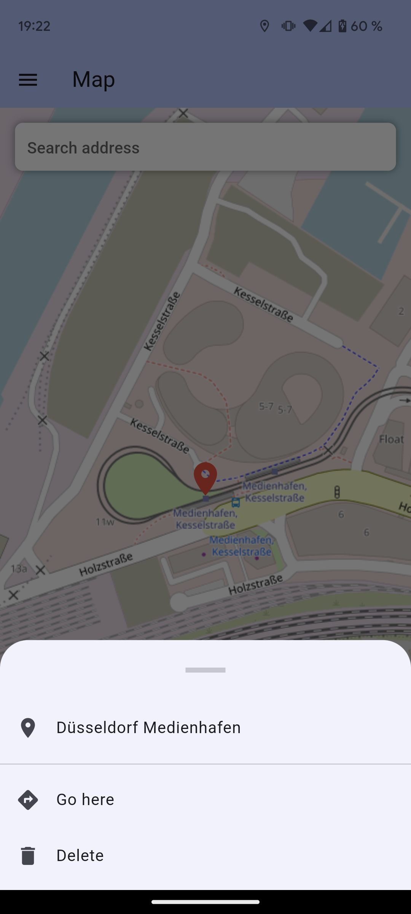

# Tour Planner

This app is developed to help me in my part-time job as a courier. It assists the user in finding a short route to all delivery addresses. It allows the user to enter many addresses which are then displayed on an overview map. 

At the moment, the route planning still has to be done by the user, but the algorithm for planning of the round trip automatically is currently being implemented. After applying the algorithm the user will still have the option to change the order of waypoints manually.

## Background

This project is a complete rework of my old tour planner app. The main reason for this was to replace the Google Map with the free Open Street Map. Besides privacy reasons this makes it easier for interested people to use this app as no paid key for the Google Maps API is needed anymore.

Address lookup is done using [Nominatim](https://nominatim.openstreetmap.org) which is the search engine for OpenStreetMap.

Since this app is essentially trying to solve the traveling salesman problem, an efficient algorithm must be used. I chose double-tree algorithm which is sometimes referred to as the twice-around-the-tree algorithm. It doesn't guarantee the shortest round trip but a pretty short one which is good enough. 

The distance between two stops is calculated by a straight line based on the coordinates. This simplifies the calculation aswell as removing the requirement of a routing algorithm.

